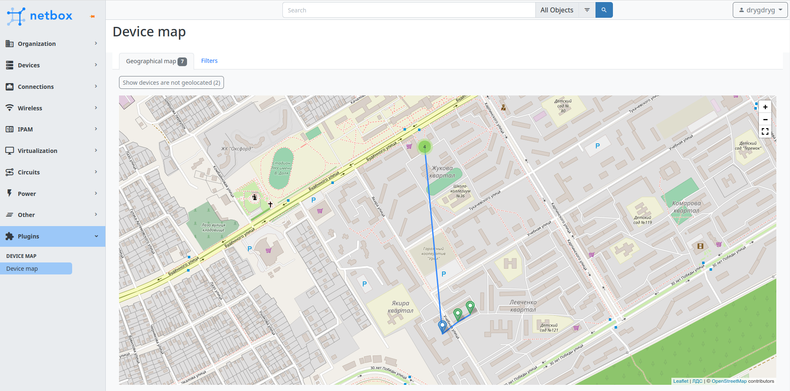
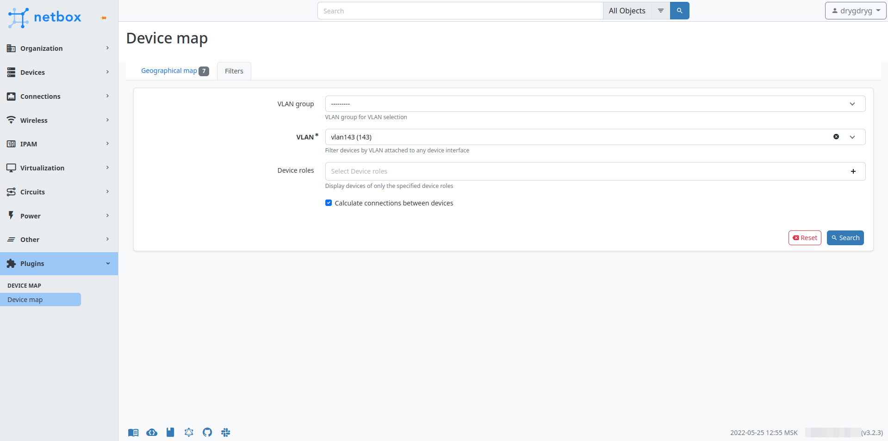

# NetBox device map
A simple device map plugin with filtering criteria for NetBox




## Installation
1. Download plugin distribution from releases.
2. If your NetBox installation uses virtualenv, activate it like this:
```
source /opt/netbox/venv/bin/activate
```
3. Install the plugin from the distribution:
```
sudo pip install /path/to/netbox-plugin-device-map.tar.gz
```
4. Add plugin to `local_requirements.txt`:

To ensure plugin is automatically re-installed during future NetBox upgrades, create a file named `local_requirements.txt` (if not already existing) in the NetBox root directory
and list the `nextbox-plugin-device-map` package:
```
echo "/path/to/netbox-plugin-device-map.tar.gz" | sudo tee -a /opt/netbox/local_requirements.txt
```
5. Collect static files:
```
sudo python /opt/netbox/netbox/manage.py collectstatic
```
6. To enable plugin, add the plugin's name to the PLUGINS list in `configuration.py` (it's usually located in `/opt/netbox/netbox/netbox/`) like so:
```
PLUGINS = [
    'netbox_device_map'
]
```
7. Restart NetBox WSGI service to apply changes:
```
sudo systemctl restart netbox
```

## Configuration
You can customize plugin behavior according to your needs. For example, change the custom field that contains device coordinates or install custom map tiles.
Update PLUGINS_CONFIG parameter in the `configuration.py` like this:
```python
PLUGINS_CONFIG = {
    'netbox_device_map': {
        'device_geolocation_cf': 'coordinates',
        'cpe_device_role': 'CPE',
        'geomap_settings': {
            'attribution': '<a href="https://osm.yourdomain.net">Your company</a> | © <a href="https://www.openstreetmap.org/copyright">OpenStreetMap</a> contributors',
            'tiles': {
                'url_template': 'https://osm.yourdomain.net/hot/{z}/{x}/{y}.png',
                'options': {
                    'maxZoom': 19
                }
            }
        }
    }
}
```
### Settings
| Setting               | Default value | Description                                                                                                 |
|-----------------------|---------------|-------------------------------------------------------------------------------------------------------------|
| device_geolocation_cf | `geolocation` | NetBox custom field for storing geographical location of devices (in the `"<latitude>,<longitude>"` format) |
| cpe_device_role       | `CPE`         | Name of the NetBox device role that contains CPE devices                                                    |
| geomap_settings       | …             | Geographical map settings                                                                                   |

#### Geographical map settings
| Setting     | Default value                                                          | Description                                           |
|-------------|------------------------------------------------------------------------|-------------------------------------------------------|
 | attribution | `Data by &copy; <a href="https://openstreetmap.org">OpenStreetMap</a>` | Attribution text in the lower right corner of the map |
| crs         | `EPSG3857`                                                             | Coordinate reference system                           | 
| tiles       | …                                                                      | Tiles layer settings                                  |

Custom tiles layer settings:

| Setting      | Example value                                                   | Description                                                                                                                                                                                                                                                                                                                            |
|--------------|-----------------------------------------------------------------|----------------------------------------------------------------------------------------------------------------------------------------------------------------------------------------------------------------------------------------------------------------------------------------------------------------------------------------|
| url_template | `https://{s}.somedomain.com/blabla/{z}/{x}/{y}{r}.png`          | `{s}` means one of the available subdomains (used sequentially to help with browser parallel requests per domain limitation; subdomain values are specified in options; a, b or c by default, can be omitted), `{z}` — zoom level, `{x}` and `{y}` — tile coordinates. `{r}` can be used to add "@2x" to the URL to load retina tiles. |
| options      | `{'subdomains' : ['a', 'b', 'c'], 'minZoom': 0, 'maxZoom': 18}` | [Leaflet TileLayer](https://leafletjs.com/SlavaUkraini/reference.html#tilelayer) options                                                                                                                                                                                                                                               |

## Acknowledgements
- [Leaflet](https://leafletjs.com/)
### Leaflet plugins
- [leaflet.fullscreen](https://github.com/brunob/leaflet.fullscreen)
- [Leaflet-SVGIcon](https://github.com/iatkin/leaflet-svgicon)
- [leaflet-sidebar](https://github.com/Turbo87/leaflet-sidebar)
